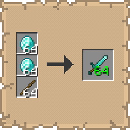

# Total Yield
   

## Installation
   
* [Modrinth](https://modrinth.com/mod/total-yield)
* [CurseForge](https://www.curseforge.com/minecraft/mc-mods/total-yield)

## Support
   
If you encounter bugs or wish to contribute:
* [Report any problems you find.](https://github.com/armaninyow/Total-Yield/discussions/categories/issues)
* [Share your ideas for new features.](https://github.com/armaninyow/Total-Yield/discussions/categories/suggestions)

## Changelog

  

   
### 1.1.0—1.21.x
* Added Crafter support
* Added Mod Menu integration with an in-game config screen
* Added Default Display setting. It controls what shows on the result slot normally:
  * VANILLA: does not interfere, slot looks exactly as it does without the mod
  * EXACT: shows the total number of items craftable with current ingredients
  * STACKS: shows the total as a stack expression
* Added Shift Display setting. It controls what shows while Shift is held, overriding the Default Display:
  * EXACT: shows the total number of items craftable
  * STACKS: shows the total as a stack expression
* Added Stack Format setting. It controls the format used when the display mode is set to STACKS:
  * MULTIPLIER: uses x as a separator (e.g. 4x64, 3x64+32)
  * SHORTHAND: uses s as a stack suffix (e.g. 4s, 3s+32)
  * GROUPED: wraps the stack size in parentheses (e.g. 4(64), 3(64)+32)
* Added Animation setting. It toggles the pop animation on the yield number
* Changed the animation zoom anchor from center to bottom-right
### 1.0.0—1.21.x
* Initial Release

